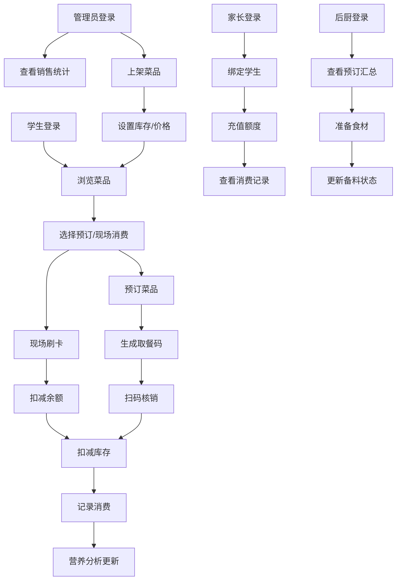

## 1. 产品概述

学校食堂预订与消费管理系统，解决传统食堂就餐排队、食材浪费、消费不透明等问题。面向学生、家长、食堂管理员、后厨人员四类用户，提供在线预订、扫码核销、充值消费、营养分析、数据统计等一体化功能。

- 核心价值：减少排队时间，降低食材浪费，提升就餐体验，助力科学饮食
- 目标用户：在校学生、学生家长、食堂管理人员、后厨工作人员

## 2. 核心功能

### 2.1 用户角色

| 角色 | 登录方式 | 核心权限 |
|------|----------|----------|
| 学生 | 学号+密码/扫码登录 | 菜品浏览、预订、取餐核销、消费记录查看、营养分析 |
| 家长 | 手机号+密码 | 绑定学生账号、充值餐饮额度、查看消费记录 |
| 食堂管理员 | 工号+密码 | 菜品上架管理、销售数据统计、收入分析、热门菜品识别 |
| 后厨人员 | 工号+密码 | 查看预订数据、备料管理、库存更新 |

### 2.2 功能模块

1. **学生端首页**：菜品展示、午晚餐预订入口、今日菜单、我的预订
2. **预订管理**：菜品选择、份数调整、预订确认、取消预订
3. **取餐核销**：生成取餐二维码、扫码核销、自动扣减库存
4. **消费中心**：消费记录、余额查询、刷脸/刷卡支付
5. **营养分析**：周期饮食统计、营养摄入分析、饮食建议
6. **家长端**：学生绑定、额度充值、消费明细、营养报告
7. **菜品管理**：菜品上架、价格设置、库存管理、营养信息录入
8. **数据统计**：日销售量、收入统计、档口分析、热门菜品排行
9. **后厨备料**：预订汇总、备料清单、出餐进度管理

### 2.3 页面详情

| 页面名称 | 模块名称 | 功能描述 |
|----------|----------|----------|
| 登录页 | 角色选择 | 学生/家长/管理员/后厨四类角色切换登录 |
| 学生端首页 | 菜品展示 | 按档口分类展示今日菜品，显示价格、剩余份数、营养标签 |
| 预订页 | 预订操作 | 选择午/晚餐时段，添加菜品到购物车，提交预订 |
| 取餐页 | 核销功能 | 显示取餐二维码，支持扫码核销，显示取餐状态 |
| 消费记录页 | 账单详情 | 按时间展示消费明细，支持筛选预订/现场消费 |
| 营养分析页 | 数据可视化 | 周/月营养摄入图表，热量、蛋白质、脂肪、维生素分析 |
| 家长端首页 | 充值中心 | 余额展示、在线充值、充值记录 |
| 家长消费页 | 消费跟踪 | 查看绑定学生的每日消费明细和营养摄入 |
| 菜品管理页 | 菜品CRUD | 新增、编辑、下架菜品，设置价格、库存、营养信息 |
| 销售统计页 | 数据看板 | 日/周/月销售图表，各档口收入对比，热门菜品TOP10 |
| 后厨备料页 | 备料清单 | 按菜品汇总预订数量，生成备料建议 |

## 3. 核心流程

### 3.1 学生预订取餐流程
学生登录系统 → 浏览当日菜品 → 选择午/晚餐菜品 → 提交预订 → 系统生成取餐码 → 到食堂扫码核销 → 系统扣减菜品份数 → 完成取餐

### 3.2 现场消费流程
学生到食堂窗口 → 选择菜品 → 刷学生卡/扫码 → 系统扣减余额 → 打印小票 → 完成支付

### 3.3 家长充值流程
家长登录 → 绑定学生账号 → 进入充值中心 → 选择充值金额 → 在线支付 → 额度到账 → 查看充值记录

### 3.4 Mermaid 流程图

## 4. 用户界面设计

### 4.1 设计风格
- **主色调**：清新绿色系 (#22c55e)，代表健康、新鲜、活力
- **辅助色**：温暖橙色 (#f97316) 用于强调按钮，浅蓝色 (#3b82f6) 用于数据可视化
- **中性色**：米白色背景 (#fafaf9)，深灰色文字 (#1c1917)，浅灰色边框 (#e7e5e4)
- **按钮风格**：圆角矩形 (8px)，微阴影，悬停时有轻微上浮效果
- **字体**：标题使用 Noto Serif SC（思源宋体），正文使用 Noto Sans SC（思源黑体）
- **布局风格**：卡片式布局，顶部导航栏，左侧角色切换侧边栏
- **图标风格**：线性图标，统一24px尺寸，搭配emoji增强亲和力

### 4.2 页面设计概述

| 页面名称 | 模块名称 | UI 元素 |
|----------|----------|---------|
| 登录页 | 角色选择 | 大标题、四类角色卡片、登录表单、背景渐变 |
| 学生端首页 | 菜品展示 | 顶部问候语、日期天气、档口分类Tab、菜品卡片网格、营养标签 |
| 预订页 | 预订操作 | 时段选择器、购物车浮窗、菜品增减按钮、总价计算、提交按钮 |
| 取餐页 | 核销功能 | 大号二维码、倒计时动画、取餐信息卡片、状态指示器 |
| 营养分析页 | 数据可视化 | 环形营养占比图、柱状趋势图、饮食建议卡片、营养指标进度条 |
| 销售统计页 | 数据看板 | 数据卡片网格、折线趋势图、柱状对比图、热门菜品排行榜 |

### 4.3 响应式设计
- **桌面优先**：1440px基准设计，栅格系统12列
- **平板适配**：1024px断点，侧边栏收起为图标模式
- **手机适配**：768px断点，底部导航栏，单列布局
- **触控优化**：按钮最小尺寸48x48px，列表项间距16px

### 4.4 动画与交互
- 页面加载：元素从下往上渐入，staggered延迟效果
- 菜品卡片：悬停时轻微上浮+阴影加深
- 预订按钮：点击时缩放反馈+成功勾选动画
- 二维码：脉冲动画提示扫码
- 数据图表：数值从0到目标值的增长动画
- 切换页面：淡入淡出过渡效果
