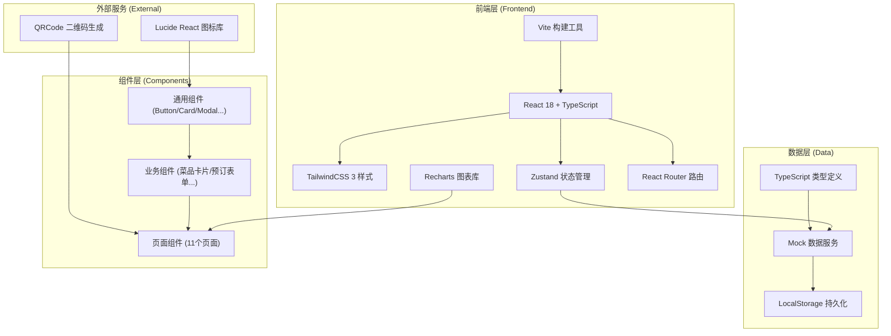
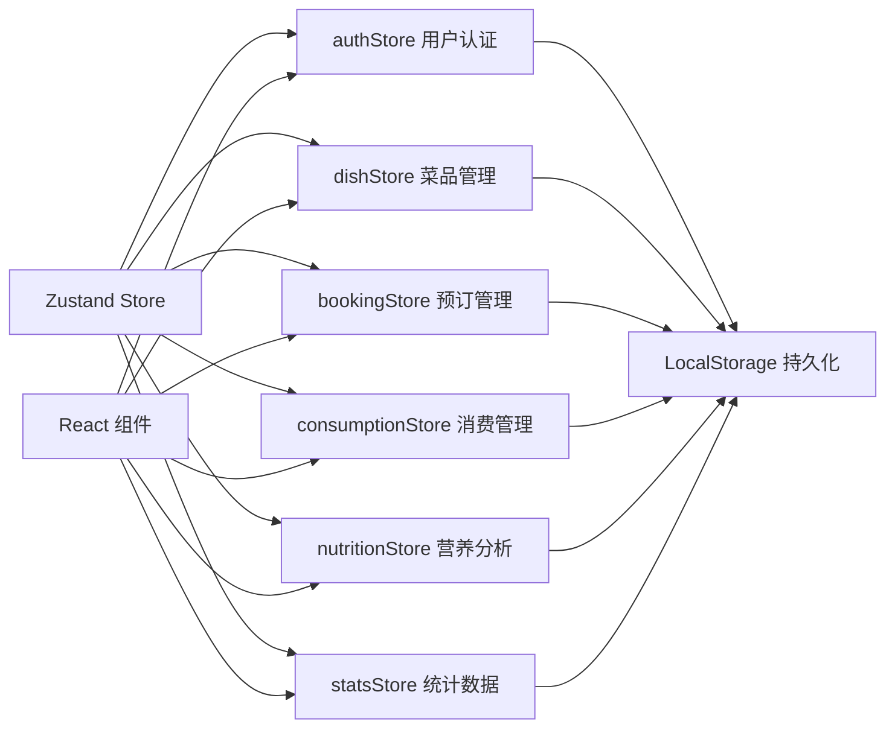
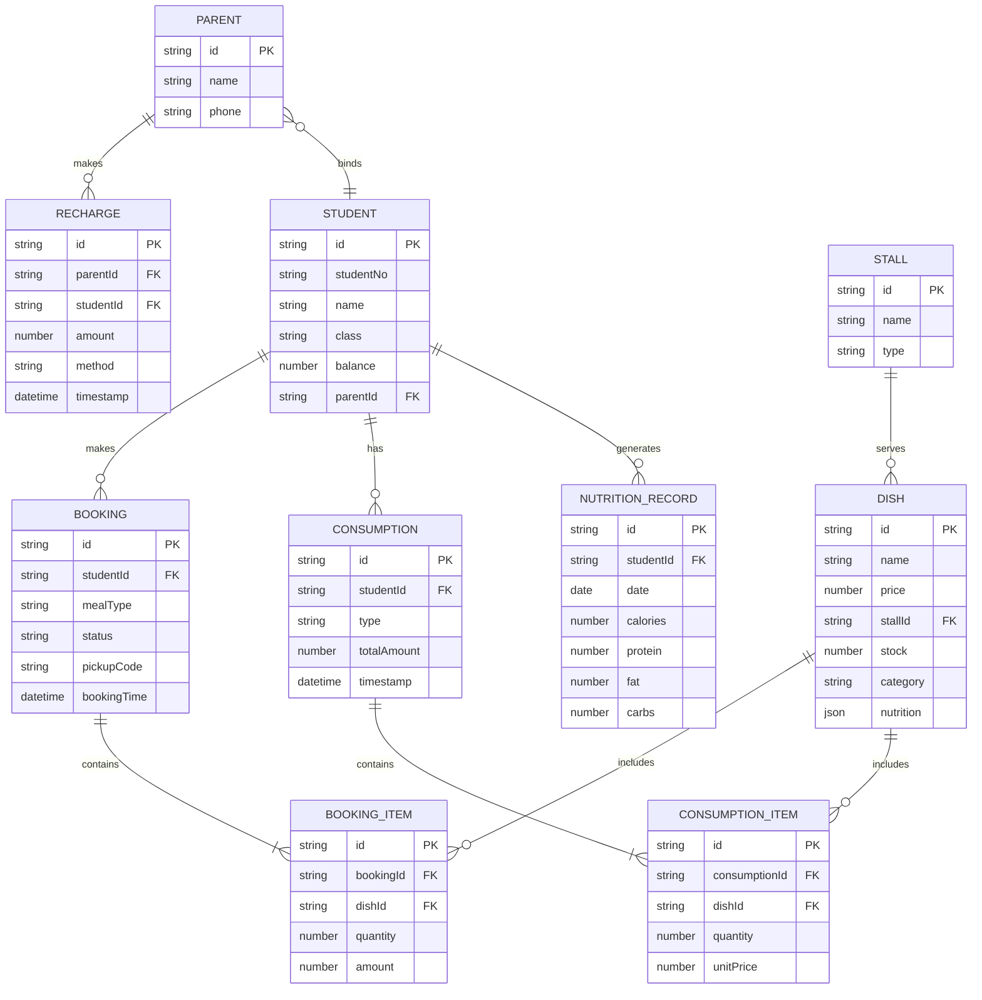

## 1. 架构设计



## 2. 技术描述

- **前端框架**: React 18.2 + TypeScript 5.0
- **构建工具**: Vite 5.0
- **样式方案**: TailwindCSS 3.4
- **状态管理**: Zustand 4.5（轻量级，避免Redux的复杂性）
- **路由管理**: React Router v6.22
- **图表可视化**: Recharts 2.12
- **二维码生成**: qrcode.react 3.1
- **图标库**: Lucide React 0.363
- **后端方案**: 无后端，使用Mock数据 + LocalStorage持久化模拟
- **数据库**: LocalStorage 浏览器存储

## 3. 路由定义

| 路由路径 | 页面名称 | 角色权限 |
|----------|----------|----------|
| `/login` | 登录页 | 所有角色 |
| `/student/home` | 学生端首页 | 学生 |
| `/student/booking` | 预订页 | 学生 |
| `/student/pickup` | 取餐核销页 | 学生 |
| `/student/consumption` | 消费记录页 | 学生 |
| `/student/nutrition` | 营养分析页 | 学生 |
| `/parent/home` | 家长端首页 | 家长 |
| `/parent/consumption` | 家长消费跟踪页 | 家长 |
| `/admin/dishes` | 菜品管理页 | 管理员 |
| `/admin/statistics` | 销售统计页 | 管理员 |
| `/kitchen/preparation` | 后厨备料页 | 后厨 |

## 4. API 类型定义

```typescript
// 用户类型
interface User {
  id: string;
  role: 'student' | 'parent' | 'admin' | 'kitchen';
  username: string;
  name: string;
  avatar?: string;
}

interface Student extends User {
  role: 'student';
  studentNo: string;
  balance: number;
  class: string;
  grade: string;
  parentId?: string;
}

interface Parent extends User {
  role: 'parent';
  phone: string;
  boundStudents: string[];
}

// 菜品类型
interface Dish {
  id: string;
  name: string;
  price: number;
  image: string;
  stallId: string;
  stallName: string;
  category: '主食' | '荤菜' | '素菜' | '汤品' | '饮品';
  stock: number;
  maxStock: number;
  nutrition: Nutrition;
  tags: string[];
  isAvailable: boolean;
  mealType: 'lunch' | 'dinner' | 'all';
}

interface Nutrition {
  calories: number;      // 热量 kcal
  protein: number;       // 蛋白质 g
  fat: number;           // 脂肪 g
  carbs: number;         // 碳水 g
  vitamins: string[];    // 维生素
}

// 预订类型
interface Booking {
  id: string;
  studentId: string;
  dishId: string;
  dishName: string;
  quantity: number;
  amount: number;
  mealType: 'lunch' | 'dinner';
  status: 'pending' | 'confirmed' | 'picked' | 'cancelled';
  bookingTime: string;
  pickupTime?: string;
  pickupCode: string;
}

// 消费记录类型
interface Consumption {
  id: string;
  studentId: string;
  type: 'booking' | 'onsite';
  items: ConsumptionItem[];
  totalAmount: number;
  balanceAfter: number;
  timestamp: string;
  stallId?: string;
}

interface ConsumptionItem {
  dishId: string;
  dishName: string;
  quantity: number;
  unitPrice: number;
  subtotal: number;
}

// 充值记录类型
interface Recharge {
  id: string;
  parentId: string;
  studentId: string;
  amount: number;
  method: 'wechat' | 'alipay' | 'card';
  status: 'success' | 'pending' | 'failed';
  timestamp: string;
}

// 销售统计类型
interface SalesStats {
  date: string;
  totalRevenue: number;
  totalOrders: number;
  dishSales: { dishId: string; dishName: string; quantity: number; revenue: number }[];
  stallStats: { stallId: string; stallName: string; revenue: number; orders: number }[];
}

// 营养分析类型
interface NutritionAnalysis {
  period: 'week' | 'month';
  startDate: string;
  endDate: string;
  avgCalories: number;
  avgProtein: number;
  avgFat: number;
  avgCarbs: number;
  dailyData: { date: string; calories: number; protein: number; fat: number; carbs: number }[];
  suggestions: string[];
  imbalanceTags: string[];
}
```

## 5. 状态管理架构



## 6. 数据模型

### 6.1 ER 图



### 6.2 初始化数据结构

```typescript
// 档口数据
const stalls = [
  { id: 'stall-1', name: '中式快餐', type: 'main' },
  { id: 'stall-2', name: '风味小吃', type: 'snack' },
  { id: 'stall-3', name: '西餐简餐', type: 'western' },
  { id: 'stall-4', name: '营养汤品', type: 'soup' },
  { id: 'stall-5', name: '饮品甜点', type: 'drink' },
];

// 菜品数据（示例）
const dishes = [
  {
    id: 'dish-1',
    name: '红烧排骨饭',
    price: 18,
    stallId: 'stall-1',
    stallName: '中式快餐',
    category: '主食',
    stock: 100,
    maxStock: 100,
    nutrition: { calories: 650, protein: 35, fat: 18, carbs: 75, vitamins: ['维生素B1', '铁'] },
    tags: ['高蛋白', '热销'],
    isAvailable: true,
    mealType: 'all',
  },
  // ... 更多菜品
];

// 学生用户
const students = [
  {
    id: 'stu-001',
    role: 'student',
    username: '202401001',
    studentNo: '202401001',
    name: '张小明',
    class: '高一(1)班',
    grade: '高一',
    balance: 500,
    parentId: 'par-001',
  },
];

// 家长用户
const parents = [
  {
    id: 'par-001',
    role: 'parent',
    username: '13800138000',
    name: '张伟',
    phone: '13800138000',
    boundStudents: ['stu-001'],
  },
];
```

## 7. 项目目录结构

```
src/
├── assets/              # 静态资源
│   ├── images/          # 图片资源
│   └── fonts/           # 字体文件
├── components/          # 通用组件
│   ├── ui/              # 基础UI组件
│   │   ├── Button.tsx
│   │   ├── Card.tsx
│   │   ├── Modal.tsx
│   │   ├── Tabs.tsx
│   │   └── ...
│   └── business/        # 业务组件
│       ├── DishCard.tsx
│       ├── BookingForm.tsx
│       ├── QRCodeDisplay.tsx
│       ├── NutritionChart.tsx
│       └── ...
├── pages/               # 页面组件
│   ├── Login.tsx
│   ├── student/
│   │   ├── Home.tsx
│   │   ├── Booking.tsx
│   │   ├── Pickup.tsx
│   │   ├── Consumption.tsx
│   │   └── Nutrition.tsx
│   ├── parent/
│   │   ├── Home.tsx
│   │   └── Consumption.tsx
│   ├── admin/
│   │   ├── Dishes.tsx
│   │   └── Statistics.tsx
│   └── kitchen/
│       └── Preparation.tsx
├── store/               # Zustand状态管理
│   ├── authStore.ts
│   ├── dishStore.ts
│   ├── bookingStore.ts
│   ├── consumptionStore.ts
│   ├── nutritionStore.ts
│   └── statsStore.ts
├── types/               # TypeScript类型定义
│   └── index.ts
├── data/                # Mock数据
│   ├── mockUsers.ts
│   ├── mockDishes.ts
│   ├── mockBookings.ts
│   └── mockConsumptions.ts
├── utils/               # 工具函数
│   ├── date.ts
│   ├── nutrition.ts
│   ├── qrcode.ts
│   └── storage.ts
├── hooks/               # 自定义Hooks
│   ├── useAuth.ts
│   ├── useBooking.ts
│   └── useNutrition.ts
├── App.tsx
├── main.tsx
└── index.css
```
